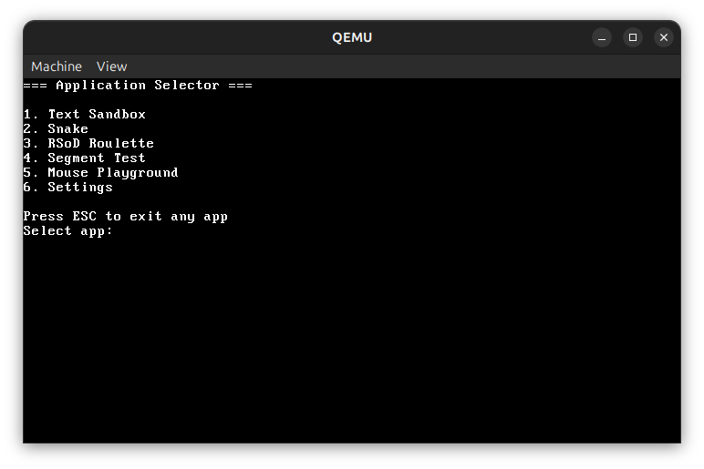

# Bare Metal Snake

A bare-metal educational operating system project for x86, originally created to implement the classic **Snake** game in protected mode without any external dependencies. The project boots from the **MBR** via BIOS and runs directly on the hardware (or QEMU).  

Over time it has grown into a small experimental OS with exception handling, keyboard input, VGA text/graphics modes, custom fonts, palette control, a stack guard mechanism, and multiple demo applications.

---

## Features

- Bootloader in **x86 assembly** (MBR).
- Enters **32-bit protected mode** directly from BIOS.
- Custom **kernel** with:
  - Full CPU exception handling.
  - Programmable Interrupt Controller (PIC) & PIT timer support.
  - PS/2 keyboard driver.
  - PS/2 mouse driver.
  - Procedurally generated cursor glyphs at runtime.
  - VGA driver with support for text mode `0x03` and graphics mode `0x13`.
  - DAC palette setup and custom font loading.
  - Expand-down stack segment with **Stack Guard**:
    - Warns at 75% stack usage.
    - Triggers a custom **Stack Overflow Interrupt** at 100%.
  - **Red Screen of Death (RSoD)** kernel panic screen.
- No dependency on `libc` or any external libraries.
- Fully freestanding kernel (written in C, C++ and assembly).
- **Applications included**:
  1. **Text Sandbox** – type freely into VGA screen buffer.
  2. **Snake** – classic snake game with a win condition (filling the field).
  3. **RSoD Roulette** – casino-like roulette that randomly triggers CPU exceptions with animations.
  4. **Segment Test** – manually explore memory by selecting segments and offsets.
  5. **Mouse Playground** – experiment with mouse input, test cursor interaction, and visualize UI element responses.

---

## Repository Structure

```
boot/         - Bootloader (boot.asm, MBR)
include/      - Public headers (arch, drivers, kernel, lib)
src/          - Kernel, architecture-specific code, drivers, applications
  apps/       - Demo programs (Snake, Sandbox, Roulette, etc.)
  arch/x86/   - Interrupt handling, ports, PIC, PIT
  kernel/     - Core kernel and drivers
  lib/        - Custom C standard library replacement
Makefile      - Build system
```

---

## Build Instructions

### Requirements
- `nasm`
- `i386-elf-gcc`
- `i386-elf-g++`
- `i386-elf-ld`
- `i386-elf-objcopy`
- `qemu-system-i386` (for testing)

<details><summary>Setup instrunction</summary><div style="margin-left: 40px;">

#### 1. Establish dependencies
```bash
sudo apt update
sudo apt install build-essential bison flex libgmp-dev libmpc-dev libmpfr-dev texinfo
```

#### 2. Build binutils
```bash
cd ~/src
wget https://ftp.gnu.org/gnu/binutils/binutils-2.42.tar.xz
tar -xf binutils-2.42.tar.xz
mkdir -p binutils-build && cd binutils-build
../binutils-2.42/configure --target=i386-elf --prefix=$HOME/opt/cross --with-sysroot --disable-nls --disable-werror
make -j$(nproc)
make install
```

#### 3. Build gcc with g++
```bash
cd ~/src
wget https://ftp.gnu.org/gnu/gcc/gcc-13.2.0/gcc-13.2.0.tar.xz
tar -xf gcc-13.2.0.tar.xz
mkdir -p gcc-build && cd gcc-build
../gcc-13.2.0/configure --target=i386-elf --prefix=$HOME/opt/cross --disable-nls --enable-languages=c,c++ --without-headers
make all-gcc -j$(nproc)
make all-target-libgcc -j$(nproc)
make install-gcc
make install-target-libgcc
```

#### 4. Add to PATH
```bash
echo 'export PATH=$HOME/opt/cross/bin:$PATH' >> ~/.bashrc
source ~/.bashrc
```

#### 5. Check
```bash
i386-elf-gcc --version
i386-elf-g++ --version
i386-elf-ld --version
```

#### 6. Install QEMU and NASM
```bash
sudo apt install nasm qemu-system-i386
```

</div></details>

---

### Build
```bash
make
```

This produces `build/snake.img`, a bootable raw image.

### Run in QEMU
```bash
make run
```

### Clean
```bash
make clean
```

---

## Running on Real Hardware

1. Write `build/snake.img` to the beginning of a storage device (e.g. USB stick) since the bootloader is in the MBR:
   ```bash
   sudo dd if=build/snake.img of=/dev/sdX bs=512
   ```
2. Boot from it using BIOS (legacy boot).
3. A **PS/2 keyboard** is required. If using USB, make sure **USB-PS/2 emulation** is enabled in BIOS/UEFI.
3. A **PS/2 mouse** is necessary for some apps. If using USB, make sure **USB-PS/2 emulation** is enabled in BIOS/UEFI.  
   _Note: Some BIOS/UEFI implementations may not support USB-PS/2 mouse emulation, so functionality could be limited._


---

## Demo Screenshots / GIFs

### Snake Game


### Text Sandbox


### RSoD Roulette


### Segment Test


### Cursor Playground


### Stack Overflow RSoD


### Application Selector


---

## Future Plans

- Dynamic memory allocation.
- Paging support.
- Additional demo applications (possibly **Tetris**).
- Snake AI mode using pre-trained weights.
- Further expansion of VGA graphics features.

---

## License & Credits

This project is authored entirely by [Remenod](https://github.com/Remenod) and is released under the **MIT License**. See [LICENSE](./LICENSE) for details.

External sources:
- VGA mode-setting code adapted from Chris Giese  
  *“Sets VGA-compatible video modes without using the BIOS”*  
  Original source: <https://files.osdev.org/mirrors/geezer/osd/graphics/modes.c>  
  License: Public domain.  

Many theoretical references were taken from [OSDev Wiki](https://wiki.osdev.org).

---

## Disclaimer

This project is experimental and intended as a learning resource.  
It runs in **ring 0 only** (CPL0), with no user mode (CPL3).  